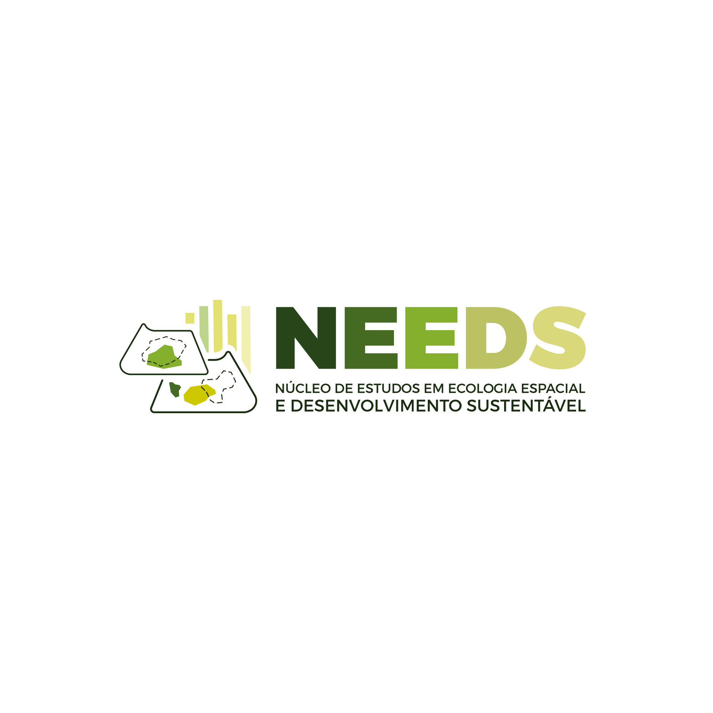

---

---

---
title: "Título da aula"
subtitle: "Curso | NEEDS/UFSCar"
author: "NEEDS – Núcleo de Estudos em Ecologia Espacial e Desenvolvimento Sustentável"
date: today
format:
  html:
    toc: true
    toc-depth: 3
    css: ../assets/css/needs.css
    embed-resources: true
  pdf:
    toc: true
    number-sections: true
execute:
  echo: true
  warning: false
  message: false
---

{.needs-logo}

# Objetivos da aula

Ao final desta aula, você deverá ser capaz de:

- compreender o conceito central da aula;
- organizar dados de forma adequada;
- executar análises simples no R;
- interpretar os resultados ecológicos.

::: callout-note
## Ideia central

Escreva aqui a mensagem principal da aula.
:::

# Contextualização

Texto introdutório da aula.

# Atividade prática

Descrição da atividade.

::: callout-tip
## Antes de começar

Verifique se você tem os pacotes necessários instalados.
:::

# Preparando o ambiente no R

```{r}
library(tidyverse)
```

# Importando os dados

```{r}
# dados <- read_csv("caminho/para/os/dados.csv")
```

# Organização dos dados

```{r}
# exemplo de manipulação
```

# Visualização

```{r}
# exemplo de gráfico
```

# Exercícios

1.  Questão 1.
2.  Questão 2.
3.  Questão 3.

::: callout-important
## Desafio

Inclua aqui uma tarefa extra para os alunos.
:::

# Síntese

Retome os principais aprendizados da aula.

::: needs-footer
NEEDS/UFSCar — Material didático em desenvolvimento.
:::
